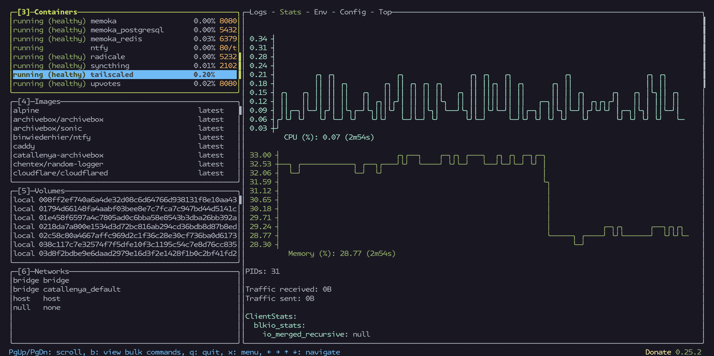

# catallenya

catallenya is personal data sovereignty project. We replace third-party services with self-hosted solutions for photo management, cloud storage, calendar and contact sync and blogging. Offers deep integration with scheduled backups, encryption and status notifications.

# Services hosted (non-exhaustive)
- [carrein-blog](https://github.com/carrein/carrein-blog)
- [Immich](https://immich.app)
- [Zipline](https://zipline.diced.sh/)
- [Memoka](https://github.com/carrein/memoka)
- [Syncthing](https://syncthing.net/)
- [Archivebox](https://archivebox.io/)
- [Radicale](https://radicale.org/v3.html)
- [Ntfy](https://ntfy.sh/)

A complete walkthrough of the server setup is available on [carrein-blog](https://catallenya.com/).
